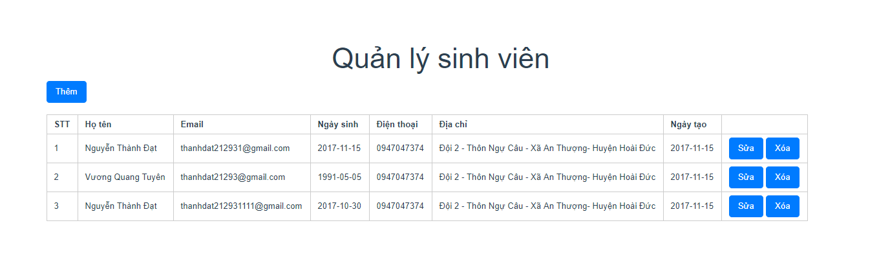

# Quản lý sinh viên

## Công nghệ sử dụng

- Back-end: **NodeJS**
- Front-end: **VueJS**
- Database: **MySQL**

## Chạy chương trình

#### 1) Cấu hình trong file: **app.js** - Dòng 6 - 9

#### 2) Import databse
- Tạo databse: **sinhvien**
- Import file **sinhvien.sql** trong thư mục **data/**

#### 3) Cài đặt modules cần thiết
- Trỏ command line tới folder /quanlysinhvien
- Chạy lệnh sau:
```
npm i
cd sinhvienclient/
npm i
```

#### 4) Chạy

1 termial trỏ tới thư mục: **quanlysinhvien**
```
node app.js
```

1 termial trỏ tới thư mục: **sinhvienclient**
```
npm run dev
```

#### 5) Chạy trên web

[http://localhost:8080](http://localhost:8080)

## Giao diện

